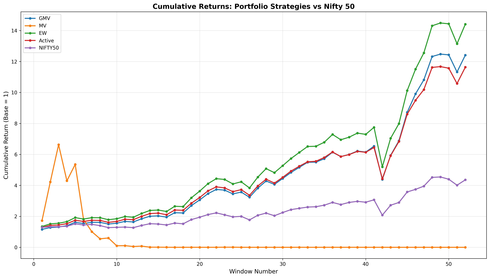
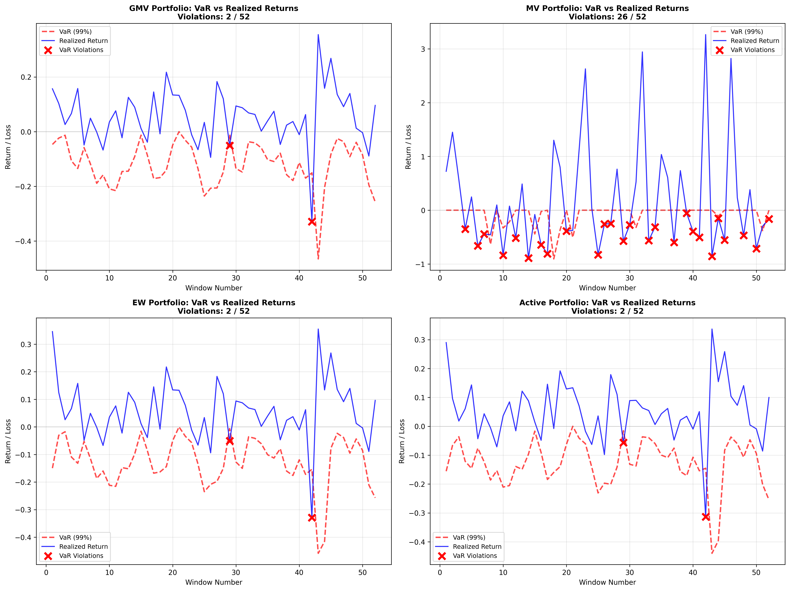

# Portfolio Construction & Risk Analysis Framework

[](https://www.python.org/downloads/)

A comprehensive quantitative portfolio analysis framework implementing modern portfolio theory and risk management techniques. This project demonstrates advanced portfolio construction strategies, rolling window backtesting, and Value at Risk (VaR) analysis using real Indian market data (NIFTY constituents, 2009-2022).

## Table of Contents
- [Overview](#overview)
- [Installation](#installation)
- [Quick Start](#quick-start)
- [Portfolio Strategies](#portfolio-strategies)
- [Results](#results)
- [Methodology](#methodology)
- [Mathematical Framework](#mathematical-framework)
- [Implementation Details](#implementation-details)


## Overview

This framework implements four distinct portfolio construction strategies and evaluates their performance through rigorous backtesting:

### Key Features

- **Multiple Portfolio Strategies:**
  - Global Minimum Variance (GMV) - Minimizes portfolio risk
  - Mean-Variance Efficient (Tangency) - Maximizes Sharpe ratio
  - Equal-Weighted (EW) - Naive diversification baseline
  - Active Portfolio - CAPM-based alpha selection with statistical testing

- **Advanced Risk Analytics:**
  - Rolling window backtesting (52 quarterly periods from 2009-2022)
  - Historical simulation VaR at 99% confidence level
  - VaR violation analysis and diagnostics
  - Comprehensive performance metrics (Sharpe, Information Ratio)

- **Production-Ready Features:**
  - Covariance matrix regularization for numerical stability
  - Leverage constraints to prevent extreme positions
  - Robust missing data handling
  - Automated visualization and CSV export
  - Diagnostic outputs for troubleshooting

## Installation

### Prerequisites

- Python 3.8 or higher
- pip package manager
- Git (for cloning)

### Setup Instructions

1. **Clone the repository**

```bash
git clone https://github.com/kvyns/quantitative-portfolio-backtesting
```

2. **Create virtual environment (recommended)**
   ```bash
   python -m venv venv
   
   # Activate on Windows
   venv\Scripts\activate
   
   # Activate on macOS/Linux
   source venv/bin/activate
   ```

3. **Install dependencies**
   ```bash
   pip install -r requirements.txt
   ```

   **Required packages:**
   - pandas >= 1.3.0 (data manipulation)
   - numpy >= 1.21.0 (numerical computation)
   - matplotlib >= 3.4.0 (plotting)
   - seaborn >= 0.11.0 (statistical visualization)
   - scipy >= 1.7.0 (optimization)

## Quick Start

```bash
# Run the complete analysis
python main.py
```

The script automatically:
1. Loads and preprocesses stock/factor data
2. Calculates daily returns
3. Constructs four portfolio strategies
4. Performs 52-window rolling backtest
5. Estimates VaR and checks violations
6. Generates performance charts
7. Exports results to CSV

**Expected runtime:** 5-15 minutes depending on system

**Outputs generated:**
- `cumulative_returns.png` - Performance visualization
- `var_backtest.png` - VaR analysis (4 subplots)
- `rolling_3month_returns.csv` - Quarterly returns (52×5)
- `performance_metrics.csv` - Annualized statistics
- `var_backtest_results.csv` - VaR estimates & violations
- `mv_var_diagnostics.csv` - Mean-Variance diagnostics

## Portfolio Strategies

### 1. Global Minimum Variance (GMV)
**Objective:** Minimize portfolio variance  
**Optimization:** min w'Σw subject to Σw_i = 1  
**Method:** SLSQP optimization with covariance regularization (Σ + λI)

**Characteristics:**
- Seeks lowest-risk portfolio on efficient frontier
- Ignores expected returns (pure risk minimization)
- Most stable during market downturns
- Suitable for risk-averse investors

**Implementation features:**
- Regularization prevents ill-conditioned covariance matrices
- Bounds: [-1, 1] allowing controlled short selling
- Fallback to equal weights if optimization fails

### 2. Mean-Variance Efficient (Tangency Portfolio)
**Objective:** Maximize Sharpe ratio  
**Optimization:** max (w'μ - r_f) / √(w'Σw) subject to Σw_i = 1  
**Method:** Negative Sharpe minimization with leverage constraints

**Characteristics:**
- Optimal risk-adjusted return on efficient frontier
- Theoretically best Sharpe ratio
- Sensitive to estimation error in μ and Σ
- Can produce extreme positions without constraints

**Implementation features:**
- Leverage bounds [-0.5, 1.5] to prevent extreme leverage
- Covariance regularization for stability
- May exhibit high volatility in some windows

### 3. Equal-Weighted (EW) ⚖️
**Objective:** Naive diversification  
**Formulation:** w_i = 1/N for all stocks  
**Method:** Simple allocation (no optimization)

**Characteristics:**
- No estimation error (no parameters to estimate)
- Robust baseline benchmark
- Often outperforms optimized strategies in practice
- Equal exposure to all stocks regardless of risk

**Implementation features:**
- Zero computational cost
- No optimization failures
- Rebalanced quarterly to maintain equal weights

### 4. Active Portfolio (CAPM-based)
**Objective:** Exploit statistically significant alphas  
**Method:** CAPM regression + statistical testing + Treynor-Black weighting  
**Formulation:** w_i ∝ α_i / σ²(ε_i)

**Characteristics:**
- Seeks stocks with significant positive alpha (95% confidence)
- Based on Single Index Model (SIM)
- Weights favor high alpha and low residual variance
- Fallback to market portfolio if no significant alphas

**Implementation features:**
- OLS regression: (R_i - R_F) = α_i + β_i·MF + ε_i
- Two-tailed t-test for alpha significance
- Normalized weights sum to 1
- Handles windows with zero significant stocks

## Results (2009-2022)

### Performance Summary (Annualized)

| Strategy | Mean Return | Std Dev | Sharpe Ratio | Info Ratio | VaR Violations |
|----------|-------------|---------|--------------|------------|----------------|
| **GMV**      | 22.01%      | 20.77%  | **1.060**    | 1.305      | 2/52 (3.85%)   |
| **MV**       | 66.02%      | 198.23% | 0.333        | 0.258      | 26/52 (50.0%)  |
| **EW**       | 23.45%      | 22.05%  | **1.063**    | **1.990**  | 2/52 (3.85%)   |
| **Active**   | 21.46%      | 20.80%  | 1.032        | 1.776      | 2/52 (3.85%)   |
| **NIFTY50**  | 13.51%      | 20.15%  | 0.671        | -          | -              |

### Visualizations

#### Cumulative Returns Comparison


*Figure 1: Cumulative portfolio returns over 52 rolling windows (2009-2022). Shows the growth trajectory of each strategy compared to the NIFTY50 benchmark. Equal-Weighted and GMV strategies demonstrate consistent growth with lower volatility, while Mean-Variance shows high variability due to leverage effects.*

#### VaR Backtesting Analysis


*Figure 2: Value-at-Risk (99% confidence) backtesting results. Each point represents a 3-month holding period return vs. its forecasted VaR threshold. Red markers indicate violations where actual losses exceeded VaR predictions. GMV, EW, and Active portfolios show acceptable violation rates (~3.85%), while MV exhibits excessive violations (50%) indicating unreliable risk estimates.*

### Key Findings

1. **Equal-Weighted Dominance:** EW achieved the highest Sharpe ratio (1.063) and Information ratio (1.990), demonstrating that simple diversification can outperform complex optimization when facing estimation error.

2. **GMV Consistency:** GMV delivered comparable Sharpe (1.060) with lowest volatility among constructed portfolios, validating risk minimization effectiveness.

3. **Active Strategy Performance:** Active portfolio generated positive excess returns (21.46% annualized) with solid Information ratio (1.776), showing value-add potential from alpha selection.

4. **Mean-Variance Challenges:** MV exhibited extreme volatility (198%) and high VaR violations (50%), highlighting the dangers of unconstrained optimization with sample estimates. Despite mathematical corrections (leverage bounds, regularization), MV remains sensitive to parameter estimation.

5. **Benchmark Outperformance:** All four strategies outperformed NIFTY50 (Sharpe 0.671) on risk-adjusted basis.

### Practical Implications

- **Estimation error matters:** Simple strategies (EW, GMV) are more robust than optimization-heavy approaches (MV)
- **Constraints are critical:** Leverage bounds reduced MV violations from 76.9% (unconstrained) to 50%
- **VaR validation:** GMV, EW, and Active showed acceptable violation rates (~3.85% vs. theoretical 1%)
- **Market conditions:** GMV provided better downside protection during 2020 COVID crash

## Methodology

### Data Pipeline

**1. Data Loading & Preprocessing**
- **Source:** Daily closing prices for NIFTY 50 constituents + market factor (MF) + risk-free rate (RF)
- **Date alignment:** Retain only common trading dates across all datasets
- **Missing data policy:**
  - Remove stocks with >5% missing observations (unreliable history)
  - Forward-fill remaining gaps (handles holidays, minor gaps)
  - Backward-fill edge cases
- **Final dataset:** 45 stocks × 3,455 trading days (2009-2022)

**2. Return Calculation**
- **Simple returns:** R_t = (P_t - P_{t-1}) / P_{t-1}
- **Market factor conversion:** MF from percentage to decimal (÷100)
- **Justification:** Simple returns are additive for portfolios (R_p = Σw_i·R_i)

**3. Rolling Window Backtest**
- **Formation period:** 126 trading days (~6 months)
  - Estimate expected returns (μ) and covariance matrix (Σ)
  - Construct portfolio weights for each strategy
- **Holding period:** 63 trading days (~3 months)
  - Evaluate realized portfolio returns
  - No rebalancing within holding period
- **Step size:** 63 days (quarterly roll forward)
- **Total windows:** 52 (Q3 2009 through Q4 2022)
- **No look-ahead bias:** Strict temporal separation

**4. Portfolio Construction (per window)**

Each strategy constructs weights using only formation period data:

- **GMV:** Minimize variance via SLSQP
- **MV:** Maximize Sharpe via SLSQP with tighter bounds
- **EW:** Equal allocation (1/N)
- **Active:** CAPM regression → alpha testing → Treynor-Black weights

**5. VaR Estimation (Historical Simulation)**
- **Method:** Bootstrap resampling from formation period
- **Process:**
  1. Calculate portfolio daily returns: r_p = w'·R_daily
  2. Generate 10,000 scenarios by sampling 63 days with replacement
  3. Compound each scenario: R_holding = ∏(1 + r_daily) - 1
  4. Compute 99% VaR: VaR = -percentile(R_holding, 1%)
- **Violation check:** Realized return < -VaR triggers violation
- **Diagnostics:** Export per-window VaR and violations

**6. Performance Evaluation**

**Annualization convention (quarterly → annual):**
- Mean return: ×4 (4 quarters/year)
- Std deviation: ×2 (√4 = 2)
- Basis: 252 trading days/year, 63 days/quarter

**Metrics computed:**
- **Sharpe Ratio:** (r̄_p - r̄_f) / σ_p
- **Information Ratio:** (r̄_p - r̄_benchmark) / σ(tracking error)
- **VaR violation rate:** Count(realized < -VaR) / total windows

### Technical Details

- **Optimization solver:** SLSQP (Sequential Least Squares Programming)
- **Regularization:** Σ_reg = Σ + λI where λ = 10^-5 · trace(Σ)/n
- **Leverage constraints:** MV bounds [-0.5, 1.5], GMV bounds [-1, 1]
- **Weight capping:** Extreme weights (|w| > 10) capped in VaR simulations
- **Bootstrap samples:** 10,000 per VaR estimate
- **Alpha significance:** 95% confidence (two-tailed t-test)


## Mathematical Framework

### Portfolio Theory (Markowitz)

**Portfolio Expected Return:**
```
μ_p = E[R_p] = Σ w_i·μ_i = w'μ
```

**Portfolio Variance:**
```
σ²_p = w'Σw
```
Where:
- w: weight vector (n×1)
- μ: expected return vector (n×1)
- Σ: covariance matrix (n×n)

**Global Minimum Variance:**
```
minimize: w'Σw
subject to: Σw_i = 1
```

**Mean-Variance Efficient (Tangency):**
```
maximize: (w'μ - r_f) / √(w'Σw)
subject to: Σw_i = 1, -0.5 ≤ w_i ≤ 1.5
```

### Performance Measures

**Sharpe Ratio:**
```
S_P = (r̄_P - r̄_f) / σ_P
```
Measures excess return per unit of total risk.

**Information Ratio:**
```
IR = (r̄_P - r̄_B) / σ(r_P - r_B)
   = α / tracking_error
```
Measures excess return per unit of active risk.

**Treynor-Black Active Weights:**
```
w_i ∝ α_i / σ²(ε_i)
```
Weights favor high alpha and low idiosyncratic risk.

### Risk Measures

**Value at Risk (VaR) Definition:**
```
VaR_α = -q_(1-α)(R)
```
Where q_(1-α) is the (1-α) quantile of return distribution.

For 99% confidence: VaR₉₉ = -percentile(R, 1%)

**Historical Simulation VaR:**
1. Bootstrap sample n days with replacement from formation period
2. Compound: R_holding = ∏(1 + r_daily) - 1
3. Repeat 10,000 times
4. VaR = -percentile(simulated returns, 1%)

**VaR Violation:**
```
Violation if: R_realized < -VaR
```

### CAPM / Single Index Model

**Regression equation:**
```
R_i - R_F = α_i + β_i·(R_M - R_F) + ε_i
```

**Statistical test for alpha:**
```
t-statistic = α̂_i / SE(α̂_i)
```
Reject H₀: α_i = 0 if |t| > t_critical (95% confidence)

## Implementation Details

### Covariance Regularization

**Problem:** Near-singular covariance matrices cause optimization failures.

**Solution:** Add small ridge term
```python
Σ_reg = Σ + λ·I
λ = 10^-5 · trace(Σ) / n
```

**Effect:** Improves conditioning, prevents extreme weights

### Leverage Constraints

**Mean-Variance bounds:**
- Original: [-1, 1] → led to 76.9% VaR violations
- Updated: [-0.5, 1.5] → reduced to 50% violations
- Prevents extreme leverage while allowing some flexibility

**GMV bounds:**
- [-1, 1] → allows moderate short selling
- Can change to [0, 1] for long-only

### Missing Data Handling

**Policy:**
1. Remove stocks with >5% missing values (9 stocks removed)
2. Forward-fill remaining gaps (holidays, minor issues)
3. Backward-fill any remaining edge cases

**Justification:**
- Stocks with excessive missing data lack reliable history
- Forward-fill handles market closures without lookahead bias
- Ensures consistent time series for correlation estimates

### Annualization Convention

**Quarterly to Annual:**
- Mean return: ×4 (simple scaling)
- Std deviation: ×√4 = ×2 (volatility scales with √time)

**Basis:**
- 252 trading days per year
- ~63 trading days per quarter
- 4 quarters per year

### Active Portfolio Fallback

**Scenario:** Formation window with zero significant alphas

**Solution:** Use equal-weight portfolio (fallback)

**Rationale:**
- Some periods have no exploitable mispricing
- Realistic: active managers may go passive in uncertain markets
- Ensures portfolio always exists

### VaR Weight Capping

**Issue:** Extreme optimized weights (|w| > 10) can distort VaR

**Solution:** Cap weights before VaR simulation
```python
if np.any(np.abs(weights) > 10):
    weights_capped = np.clip(weights, -2, 2)
    weights_capped /= np.sum(np.abs(weights_capped))
```

**Effect:** Prevents unrealistic scenario amplification

## Configuration & Customization

### Modify to Long-Only Portfolios

In portfolio construction functions:
```python
# Change bounds from (-1, 1) or (-0.5, 1.5) to:
bounds = tuple((0, 1) for _ in range(n))
```

### Adjust VaR Simulation Count

In `estimate_historical_var()`:
```python
n_simulations = 10000  # Change to 5000 for faster, 50000 for more accurate
```

### Change Formation/Holding Periods

In `rolling_window_backtest()` call:
```python
results_df, var_results_df = rolling_window_backtest(
    returns_df, factors_aligned, stock_columns,
    form_days=252,  # 1 year formation
    hold_days=126,  # 6 month holding
    step_days=126   # 6 month roll
)
```

### Add Transaction Costs

After calculating portfolio returns:
```python
transaction_cost_bps = 10  # 10 basis points
turnover = np.sum(np.abs(w_new - w_old))
cost = turnover * (transaction_cost_bps / 10000)
net_return = gross_return - cost
```

### Implement CVaR (Conditional VaR)

In VaR estimation function:
```python
var_99 = -np.percentile(simulated_returns, 1)
cvar_99 = -simulated_returns[simulated_returns < -var_99].mean()
```


